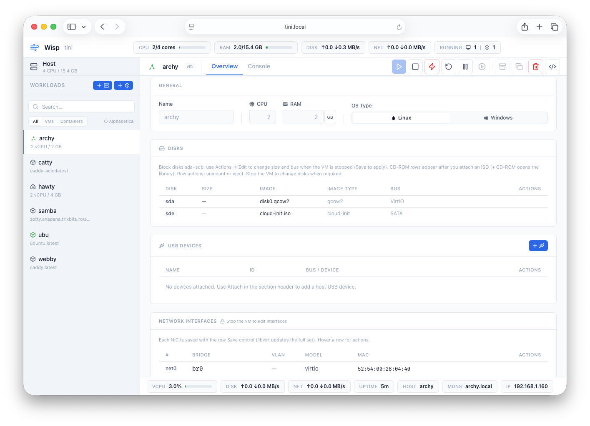
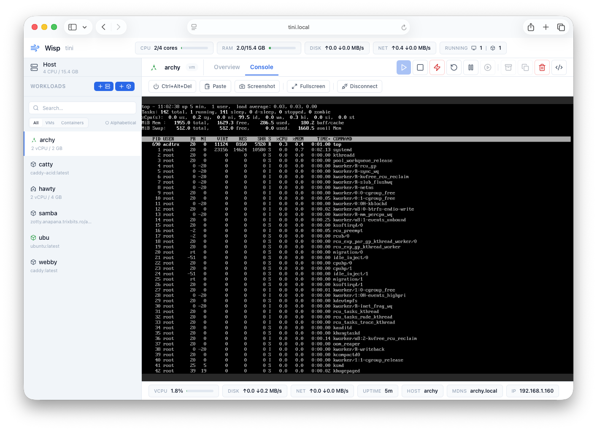
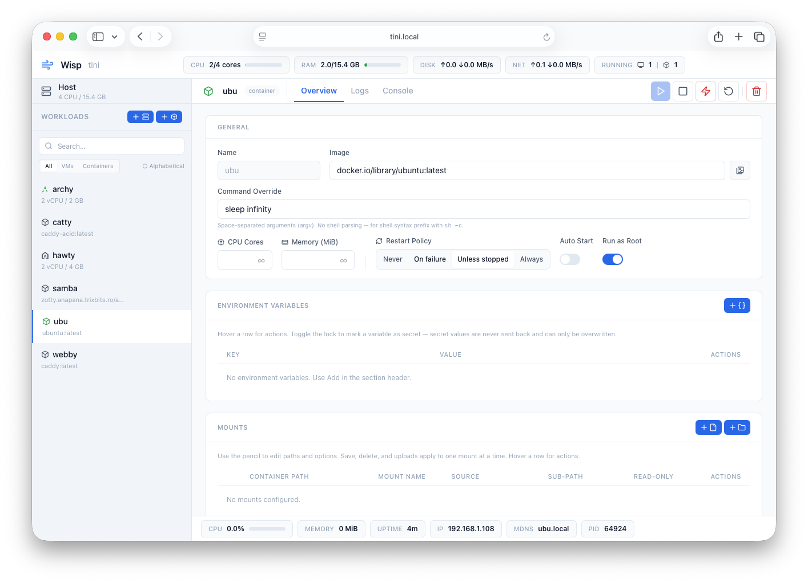
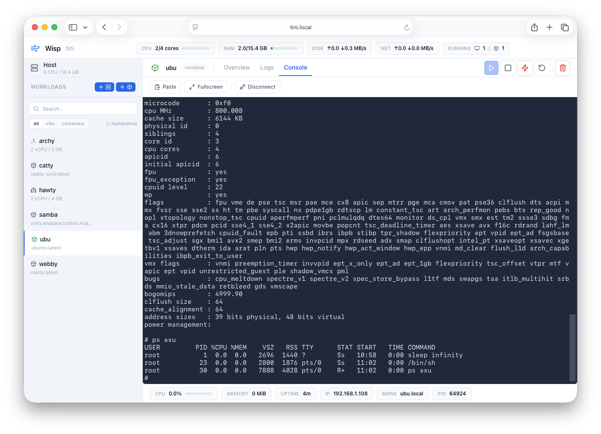
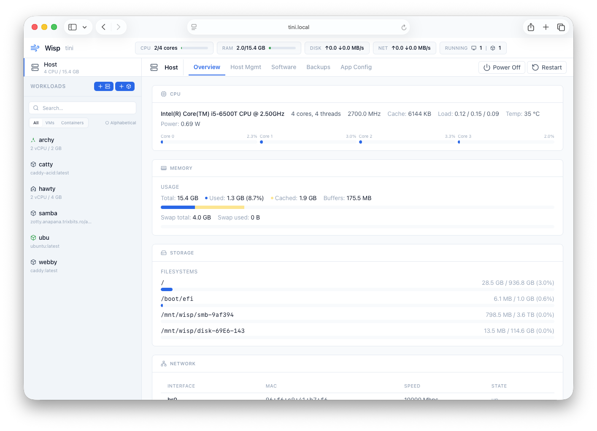
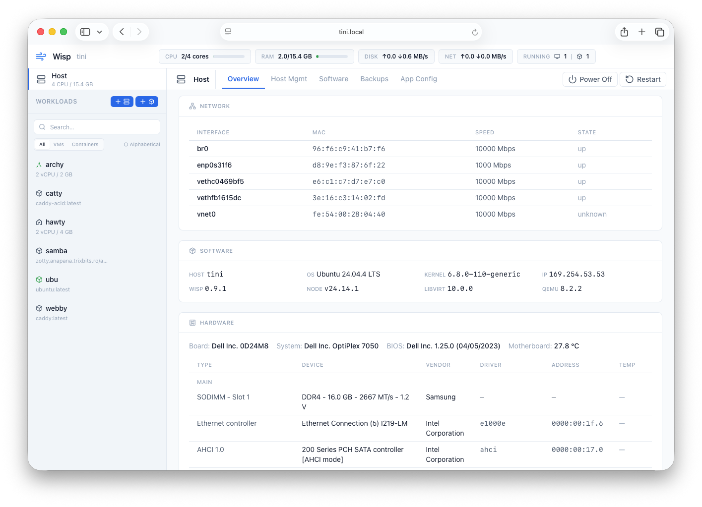
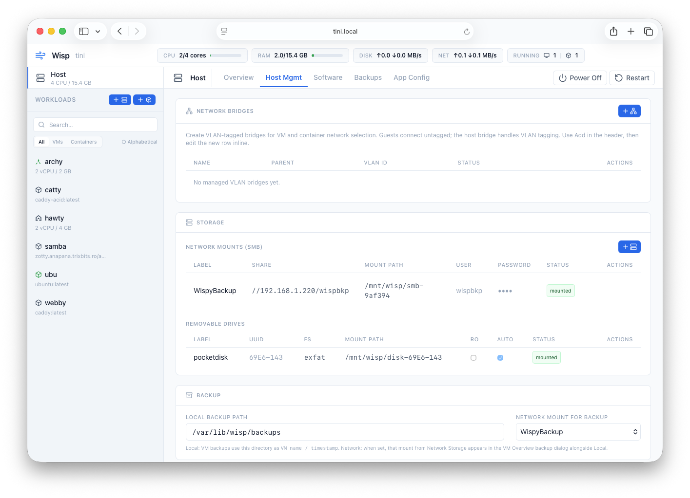

# Wisp

**Wisp** is an **opinionated, single-user** web app for managing **KVM/QEMU virtual machines** and **containerd-backed containers** on a single Linux host. It aims to be **simple to use** with **sensible defaults** — the defaults I wanted for my own homelab, which others may find useful too.

The philosophy: direct flows and clear choices instead of exhaustive configuration surfaces. If you need to fine-tune every knob, Wisp is probably not for you.



## What it does

### Virtual machines

- **Spin up a VM from a cloud image without touching the CLI.** Pick an image, size the disk, click create — Wisp copies the image, resizes it, generates cloud-init, and starts the VM.
- **Built-in downloader** for the latest **Ubuntu**, **Arch Linux**, and **Home Assistant OS** images.
- **Cloud-init provisioning** with a simple UI: username, password (hashed server-side), SSH keys imported by **GitHub username**, hostname, package upgrades, optional qemu-guest-agent and avahi install. Soft-disable keeps the config around for re-enable; full delete is also available.
- **Snapshots** (create, list, revert) and **full backups** to local disk or **SMB network shares**. Backups are gzipped with a manifest so you can **restore as a new VM** with a fresh UUID and MAC.
- **USB passthrough** — hot-plug devices into running VMs or persist them for stopped VMs, with live discovery as devices connect and disconnect.
- **noVNC console** in the browser for control and install flows.

### Containers

- **Spin up a container that's on the network like a VM.** Every container gets a real LAN IP on the host bridge — reachable from any machine on your network, not hidden behind NAT.
- **App templates** for common workloads: **Caddy** for automatic TLS reverse proxy via Let's Encrypt (Cloudflare DNS challenge supported), **Zot** for a local OCI registry. More templates to come.
- **Interactive shell console** (xterm + containerd exec) for debugging, plus a **Log view** with per-session and full history.
- **File and directory mounts** with an in-browser editor and zip upload for quick config edits.
- **Structured secrets** (write-only env vars), **image update checker**, **CPU/memory limits**, and **auto-start on boot**.

### Networking

- Every workload — VM or container — sits on the host bridge as a first-class LAN citizen. No overlay networks, no NAT, no port mapping.
- **Unified mDNS**: VMs and containers can have their IP registered under `.local` automatically via avahi. Containers can also **resolve** `.local` names, thanks to an in-process DNS stub that Wisp runs on the bridge.

### Host monitoring

- **Live host stats** via SSE: CPU, memory, disk, network I/O, thermals (per zone with thresholds), SMART disk health, RAM modules, PCI devices with live temps. Read directly from `/proc` and `/sys` — no external agent.
- **Per-VM stats**: vCPU usage, disk/net I/O, uptime, guest hostname/IP (via qemu-guest-agent).
- **Hybrid CPU awareness** (P-core / E-core topology) and Intel RAPL power measurement when available.
- **OS package update checker** (runs hourly) for the host, with in-app upgrade on Debian/Ubuntu (apt) and Arch (pacman). **Host shutdown/reboot** from the UI.

## What it's not

Wisp is not trying to replace anything. If one of these fits your workflow better, use it:

- **[Proxmox](https://www.proxmox.com/)** — if you want control over every detail, clustering, HA, or multi-user access, use Proxmox.
- **[Docker](https://www.docker.com/) / [docker compose](https://docs.docker.com/compose/) / [Arcane](https://arcane.ottomator.ai/)** — if you want a Compose-style workflow, or Docker-native tooling, use those. Wisp drives containerd directly and does not speak the Docker API.

Wisp is single-user, single-host, and deliberately scoped.

## Built with AI tools

This project was initially built with [Cursor](https://cursor.com) and more recently with [Claude](https://claude.com/claude-code). The codebase has detailed rules (`CLAUDE.md`, `.cursor/rules/`, `docs/`) that work well with AI-assisted editors. If you want a feature that isn't here, **fork it** and point your AI tool of choice at it — the rules file will keep it on-pattern.

## Requirements

- **Linux host**: Debian, Ubuntu, or Arch Linux (distro is auto-detected).
- **KVM/QEMU, libvirt, containerd 2.0+** — installed by the project's setup script.
- **Node.js 24+ LTS**.
- Optional: a **bridge interface** (`br0`) for workloads to join your LAN.

macOS is supported for backend development (no hypervisor features); production is Linux only.

**Trying it safely**: install Wisp in a dedicated Linux VM with **nested virtualization** enabled on your hypervisor, so guest VMs can still use KVM.

## Installation

Full details in [`docs/spec/DEPLOYMENT.md`](./docs/spec/DEPLOYMENT.md). The recommended path is to grab a published release — no git clone, no Node build on the install host.

1. **Download the latest release tarball** from the [Releases page](https://github.com/acdtrx/wisp/releases/latest). Look for `wisp-X.Y.Z.tar.gz` under *Assets*.

2. **Extract on the target Linux host**:
   ```
   tar -xzf wisp-X.Y.Z.tar.gz
   cd wisp
   ```

3. **Install as your normal (non-root) user** — the script will use `sudo` itself for the steps that need it (host packages, libvirt setup, systemd units):
   ```
   ./scripts/install.sh /opt/wisp --restart-svc
   ```

   `--restart-svc` skips the interactive restart prompt and starts services on first run. The release tarball ships a prebuilt `frontend/dist/`, so no Node build runs on the install host.

After install, two systemd services run the app: `wisp-backend` and `wisp-frontend`. Default frontend port is **8080** (override via `config/runtime.env`). Set or rotate the login password with `./scripts/wispctl.sh password`.

**Updates after install** — use the in-app **Wisp Update** section (Host → Software). Wisp polls GitHub Releases hourly; the Install button downloads the new tarball, verifies its checksum, and atomic-swaps it via a dedicated systemd unit.

**Developing from a checkout** — clone the repo, run `./scripts/install.sh /opt/wisp` from inside it (frontend is built locally). For pushing to a remote host: `./scripts/push.sh user@host /opt/wisp --restart-svc`.

## Security

Wisp is a **single-password** control plane with **full access to libvirt, host storage, and optional SMB credentials**. Run it only on hosts and networks you trust, protect the login and `config/` directory, and treat anything in this category as security-sensitive when reporting.

Authentication: one password per host (scrypt-hashed in `config/wisp-password`), 24-hour JWT sessions.

## Documentation

Technical docs live under [`docs/`](./docs/):

- [Architecture](./docs/ARCHITECTURE.md) · [Tech stack](./docs/TECHSTACK.md) · [Coding rules](./docs/CODING-RULES.md)
- API ([`docs/spec/API.md`](./docs/spec/API.md)), Deployment ([`docs/spec/DEPLOYMENT.md`](./docs/spec/DEPLOYMENT.md))
- Feature specs in [`docs/spec/`](./docs/spec/) — VMs, containers, cloud-init, backups, snapshots, USB, console, host monitoring, and more.

## Bugs and feedback

Please report bugs and feature requests via **GitHub Issues**.

## License

Wisp is released under the **MIT License** — see [`LICENSE`](./LICENSE).

## Screenshots

**VM overview** — per-VM details, disks, USB passthrough, and network interfaces.


**VM console** — in-browser noVNC for control and install flows.



**Container overview** — image, command, env vars, mounts, and live stats.



**Container console** — xterm attached via containerd exec.



**Host overview** — CPU, memory, storage, and network read from `/proc` and `/sys`.



**Host hardware** — software versions, board/system info, RAM modules, PCI devices with live temps.



**Host management** — VLAN bridges, SMB network mounts, removable drives, and backup targets.


