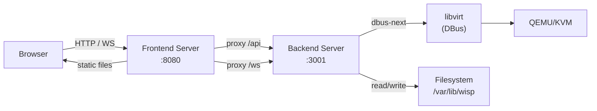
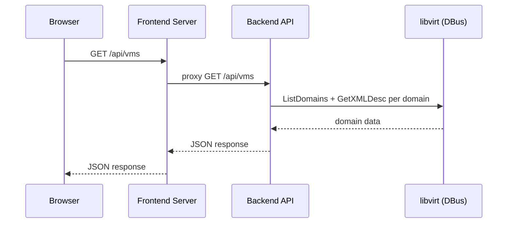
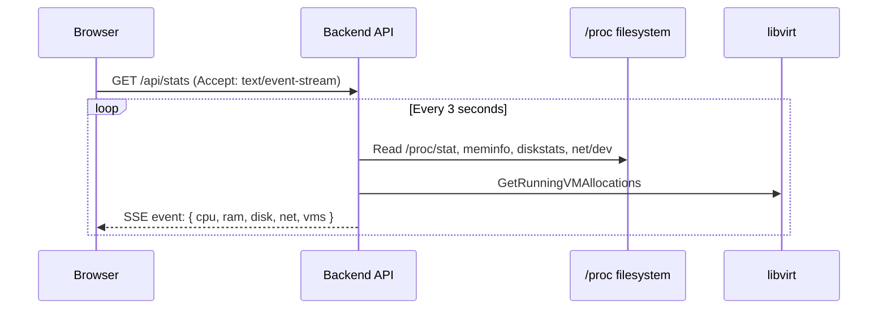
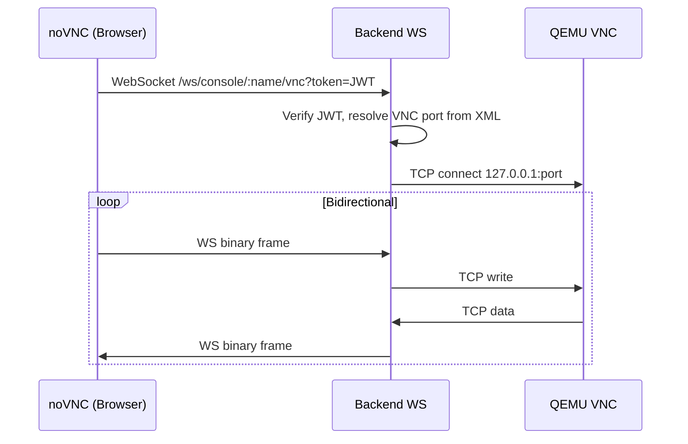

# Architecture

## System Overview

Wisp consists of two Node.js processes and the system's libvirt daemon:



### Frontend server (production)

A lightweight static file server that:
- Serves the built frontend files from `dist/`
- Serves vendored noVNC from `public/vendor/`
- Proxies `/api/*` requests to the backend
- Proxies `/ws/*` WebSocket connections to the backend
- Returns `index.html` for all unmatched routes (SPA fallback)
- Returns 503 when the backend is unreachable

### Backend server

The application backend that:
- Connects to libvirt via DBus at startup
- Connects to avahi-daemon via DBus at startup for workload mDNS registration
- Exposes REST API endpoints under `/api/`
- Exposes WebSocket endpoints under `/ws/`
- Manages VM lifecycle, configuration, storage, and monitoring
- Reads host metrics from `/proc`
- Auto-mounts configured network (SMB) mounts at startup

### Development mode

In development, the frontend build tool's dev server serves the frontend with hot module replacement and proxies `/api` and `/ws` to the backend at `127.0.0.1:3001`. CORS is enabled on the backend for `localhost:5173`. The backend can run on macOS without libvirt (dev mode skips hypervisor connection).

## Data Flow Patterns

### REST API



### Server-Sent Events (SSE)

Used for real-time streaming of stats and long-running job progress:



Three SSE patterns:

| Pattern | Endpoints | Behavior |
|---------|-----------|----------|
| Long-lived stream | `/api/stats`, `/api/vms/stream`, `/api/vms/:name/stats` | Continuous push at intervals, client reconnects on error |
| Job progress | `/api/vms/create-progress/:jobId`, `/api/vms/backup-progress/:jobId`, `/api/library/download-progress/:jobId`, `/api/containers/create-progress/:jobId` | Emits progress events until completion/failure, then closes |
| One-shot | URL check responses | Single response, no streaming |

### WebSocket (VNC Console)



## Backend Module Structure

### Entry point

`backend/src/index.js` — Creates the Fastify server, registers plugins (CORS, multipart, WebSocket), applies the auth hook, registers all route modules, connects to libvirt, and starts listening.

### Routes (`backend/src/routes/`)

Each file registers routes under a common prefix. Routes handle HTTP concerns (validation, status codes, response shaping) and delegate business logic to vmManager or other library modules.

| File | Prefix | Domain |
|------|--------|--------|
| `auth.js` | `/api/auth` | Login, password change |
| `host.js` | `/api` | Host info, bridges, firmware, USB, USB SSE stream, OS updates |
| `stats.js` | `/api` | Host stats SSE stream |
| `backgroundJobs.js` | `/api` | In-memory background job listing (`GET /background-jobs`) |
| `library.js` | `/api` | Image library CRUD, uploads, downloads |
| `vms.js` | `/api` | VM CRUD, lifecycle, disks, CDROM, USB, snapshots, stats, backups |
| `containers.js` | `/api` | Container CRUD, lifecycle, mounts, logs, stats, create job + SSE |
| `cloudinit.js` | `/api` | Cloud-init config, GitHub SSH keys |
| `settings.js` | `/api` | App settings, network mount status/mount |
| `backups.js` | `/api` | Backup listing, restore, delete |
| `console.js` | `/ws` | VNC WebSocket proxy |

### vmManager (`backend/src/lib/vmManager.js`)

Platform facade: at load time it imports **`backend/src/lib/linux/vmManager/`** on Linux (libvirt over DBus) or **`backend/src/lib/darwin/vmManager/`** on macOS (dev stub). This is the single integration boundary with libvirt — no route or other module imports `dbus-next` for libvirt or calls libvirt except through this facade; only code under `linux/vmManager/` does. Avahi (mDNS) uses `dbus-next` in **`linux/mdnsManager.js`** only (separate DBus service).

Shared pure helpers live in **`backend/src/lib/vmManagerShared.js`** (re-exported through the facade).

| Module (under `linux/vmManager/`) | Responsibility |
|--------|---------------|
| `vmManagerConnection.js` | DBus connection lifecycle (`connect`, `disconnect` on shutdown), domain lookup, state queries, XML retrieval, error helpers (MAC/format helpers from `vmManagerShared`) |
| `vmManagerHost.js` | Host info (versions, hardware), running VM allocations, bridge/firmware/USB enumeration |
| `vmManagerList.js` | List all VMs (cached, event-driven refresh), get full VM config (parsed from XML) |
| `vmManagerLifecycle.js` | Start, stop, force-stop, reboot, suspend, resume |
| `vmManagerCreate.js` | Create VM (XML generation, disk provisioning), delete, clone |
| `vmManagerConfig.js` | Update VM configuration (live vs offline, restart detection) |
| `vmManagerDisk.js` | Attach/detach/resize local disks |
| `vmManagerIso.js` | Attach/eject ISO images to CDROM slots |
| `vmManagerUsb.js` | USB device attach/detach |
| `vmManagerSnapshots.js` | Snapshot CRUD and revert |
| `vmManagerBackup.js` | Backup creation, listing across destinations, restore, delete |
| `vmManagerStats.js` | Per-VM stats, raw XML, VNC port extraction |
| `vmManagerCloudInit.js` | Cloud-init config management, ISO generation/attach/detach |
| `vmManagerXml.js` | XML parsing and building utilities (fast-xml-parser) |
| `libvirtConstants.js` | Libvirt state names and constant mappings |

### containerManager (`backend/src/lib/containerManager.js`)

Platform facade: imports **`backend/src/lib/linux/containerManager/`** on Linux (gRPC to containerd) or **`backend/src/lib/darwin/containerManager/`** on macOS (dev stub). Path helpers and `buildOCISpec` are re-used from the Linux tree where they have no gRPC dependency. Routes import only the facade; only `linux/containerManager/*` imports `@grpc/grpc-js`.

| Module (under `linux/containerManager/`) | Responsibility |
|--------|---------------|
| `index.js` | Re-exports the Linux implementation for the facade |
| `containerManagerConnection.js` | gRPC client, containerd connection lifecycle |
| `containerManagerSpec.js` | OCI spec builder from `container.json` + image config |
| `containerManagerExec.js` | Interactive shell: containerd `Tasks.Exec` + PTY (FIFO I/O) for the container console WebSocket |
| `containerManagerNetwork.js` | Bridge CNI, netns, DHCP IP discovery |
| `containerManagerLifecycle.js` | Start, stop, kill, restart, task lifecycle |
| `containerManagerCreate.js` | Create container (pull, snapshot, define) |
| `containerManagerConfig.js` | Read/update persisted config |
| `containerManagerList.js` | List containers / summaries |
| `containerManagerStats.js` | Per-container metrics |
| `containerManagerLogs.js` | Log tail / SSE |
| `containerManagerMounts.js` | Mount orchestration |
| `containerManagerMountCrud.js` | Add/update/remove mount rows |
| `containerManagerMountsContent.js` | File/zip upload, content read/write for mounts |
| `containerPaths.js` | Path helpers under `containersPath` |

### Supporting libraries (`backend/src/lib/`)

| Module | Purpose |
|--------|---------|
| `auth.js` | JWT sign/verify, password verification, auth hook factory |
| `config.js` | Sync reader for `wisp-config.json` with defaults (including `containersPath`) |
| `settings.js` | Async read/write of `wisp-config.json`, network mount CRUD, masked API responses, backup destination helpers (mutex-serialized writes) |
| `loadRuntimeEnv.js` | Optional `config/runtime.env` parsing (loaded from `index.js` before server start) |
| `createJobStore.js` | Preconfigured job store for VM create progress (`routes/vms.js`) |
| `containerJobStore.js` | Job store wrapper for container create (`routes/containers.js`) |
| `downloadUtils.js` | Shared helpers for library downloads (`findUniqueFilename`, streaming) |
| `fileTypes.js` | `detectType` for image library files |
| `bridgeNaming.js` | VLAN bridge name helpers (shared with host + vmManager) |
| `pciIds.js` | PCI vendor/device name lookup from system `pci.ids` |
| `paths.js` | `getVMBasePath(name)`, `getImagePath()`, `ensureImageDir()` (container roots: `containerManager` `containerPaths.js` / `getContainersPath()`) |
| `routeErrors.js` | `createAppError()`, `handleRouteError()`, `sendError()`, error code-to-HTTP mapping |
| `validation.js` | VM name validation |
| `sse.js` | SSE response helper (`setupSSE`, `closeAllSSE` on shutdown) |
| `usbMonitor.js` | Facade: Linux implementation under `linux/host/usbMonitor.js` (sysfs + `/dev/bus/usb` watch); macOS stub under `darwin/host/usbMonitor.js` |
| `diskOps.js` | `qemu-img` operations: info, copy/convert, resize (with progress) |
| `cloudInit.js` | Cloud-init ISO generation via `cloud-localds` or `genisoimage` |
| `jobStore.js` | Generic async job store with progress tracking (`kind`, `title`, `listJobs`) |
| `backgroundJobTitles.js` | Display titles for background jobs (parity with UI) |
| `listBackgroundJobs.js` | Merges job rows from create/backup/download/container stores for `GET /api/background-jobs` |
| `backupJobStore.js` | Backup-specific job store |
| `downloadJobStore.js` | Download-specific job store |
| `downloadFromUrl.js` | Generic URL download with progress |
| `downloadUbuntuCloud.js` | Ubuntu Server cloud image download |
| `downloadHaos.js` | Home Assistant OS image download |
| `smbMount.js` | Facade: SMB via `wisp-smb` on Linux (`linux/host/smbMount.js`); macOS stub |
| `networkMountAutoMount.js` | Auto-mount configured network (SMB) mounts at startup |
| `hostHardware.js` | Facade: hardware inventory on Linux (`linux/host/hostHardware.js`); macOS stub |
| `hostPower.js` | Facade: `wisp-power` on Linux; macOS stub |
| `hostNetworkBridges.js` | Facade: netplan/managed bridges on Linux; macOS stub |
| `procStats.js` | Facade: host stats from `/proc` on Linux; macOS stub |
| `aptUpdates.js` | Facade: `wisp-os-update` on Linux; macOS stub |
| `mdnsHostname.js` | Pure hostname/CIDR helpers for mDNS (no DBus) |
| `mdnsManager.js` | Facade: Avahi DBus on Linux (`linux/mdnsManager.js`); macOS stub |

### Backend helper scripts (`backend/scripts/`)

Source copies live in the repo; **`scripts/linux/setup/install-helpers.sh`** copies them to **`/usr/local/bin`** on install and upgrade (`setup-server.sh`, `wispctl helpers`, `push.sh`). See DEPLOYMENT.md *Privileged helpers checklist* when adding a script.

| Script | Purpose |
|--------|---------|
| `wisp-os-update` | Check for and install OS package updates — Debian/Ubuntu (apt) and Arch (pacman); distro detected at runtime (invoked via `sudo`) |
| `wisp-smb` | Mount/unmount/check SMB shares (invoked via `sudo`) |
| `wisp-power` | Shut down or reboot the host (`/usr/local/bin` after setup, invoked via `sudo -n`) |
| `wisp-dmidecode` | Output RAM DIMM JSON for Host Overview (type, size, speed, slot, form factor, manufacturer, voltage; `/usr/local/bin` after setup, invoked via `sudo -n`) |
| `wisp-netns` | `ip netns add|delete` under `/var/run/netns` for container bridge networking (`sudo -n`) |
| `wisp-cni` | Run one CNI plugin (e.g. bridge) with config file; `sudo -n` |
| `wisp-smartctl` | Disk SMART summary via `smartctl --json` (`sudo -n`; see HOST-MONITORING) |
| `wisp-bridge` | Managed VLAN bridges via netplan (`sudo -n`; Host Mgmt network bridges) |

## Frontend Module Structure

### Entry point

`frontend/src/main.jsx` renders the React app into the DOM. `App.jsx` sets up routing: `/login` is public, all other routes are protected by authentication.

### View management

The URL is the source of truth for which view and tab are active. `AppLayout` is a shell (TopBar + LeftPanel + react-router `<Outlet />`); nested routes decide what renders inside the outlet:

| Route | Element |
|-------|---------|
| `/` | `<Navigate to="/host/overview" replace />` |
| `/host/:tab` | `HostPanel` (tabs: `overview`, `host-mgmt`, `software`, `backups`, `app-config`) |
| `/vm/:name/:tab?` | `VmRoute` → `OverviewPanel` + `VMStatsBar` (tabs: `overview`, `console`) |
| `/container/:name/:tab?` | `ContainerRoute` → `ContainerOverviewPanel` + `ContainerStatsBar` (tabs: `overview`, `logs`, `console`) |
| `/create/vm` | `CreateVMPanel` |
| `/create/container` | `CreateContainerPanel` |
| `*` | `<Navigate to="/host/overview" replace />` |

`VmRoute` / `ContainerRoute` read `:name` from `useParams`, call `selectVM` / `selectContainer` on mount (starting the per-workload stats SSE) and `deselectVM` / `deselectContainer` on unmount. Tab buttons and sidebar list items call `navigate()` rather than setting store state, so refreshing the browser restores the same view and tab.

### Stores (`frontend/src/store/`)

| Store | State managed |
|-------|--------------|
| `vmStore` | VM list (SSE `startVMListSSE` / `stopVMListSSE`), selected VM, VM config (seeded from list data for instant header), VM stats, configLoading/error, VM action dispatchers |
| `uiStore` | Sidebar list filter (`listFilter`) |
| `authStore` | Auth token, login/logout |
| `settingsStore` | App settings, loading/error |
| `statsStore` | Host stats (CPU, RAM, disk, net) from SSE stream |
| `usbStore` | Host USB device list from `/api/host/usb/stream` |
| `hostStore` | Host hardware inventory (`GET /api/host/hardware`) for Host Overview |
| `containerStore` | Container list/config (SSE + REST), selected container |

### API layer (`frontend/src/api/`)

| Module | Purpose |
|--------|---------|
| `client.js` | Base fetch wrapper with auth token injection, 401 redirect to login |
| `vms.js` | VM CRUD, power actions, disks, CDROM, USB, snapshots, cloud-init, host bridges |
| `host.js` | Host info, OS update check/upgrade |
| `settings.js` | Settings CRUD, network mount status/mount |
| `auth.js` | Password change |
| `backups.js` | Backup start, restore, delete, list |
| `library.js` | Image library CRUD, upload, URL download, preset downloads |
| `containers.js` | Container CRUD, power, mounts, logs; uses `sse.js` / `upload.js` |
| `sse.js` | SSE helpers: `createSSE()` (long-lived with reconnect), `createJobSSE()` (one-shot) |
| `upload.js` | Shared XHR multipart upload with progress (`postMultipartFile`) |
| `console.js` | WebSocket URL builder for VNC console (includes token as query param) |

### Components (`frontend/src/components/`)

```
components/
├── layout/           App shell: TopBar, BackgroundJobsIndicator, LeftPanel, AppLayout, HostStatsBar
├── vm/               VM views: OverviewPanel, CreateVMPanel, VMListItem, VMStatsBar,
│                     CloneDialog, BackupModal, XMLModal
├── container/        CreateContainerPanel, ContainerOverviewPanel, ContainerListItem, ContainerStatsBar
├── sections/         Shared form sections (Overview + Create VM where noted):
│                     GeneralSection, DisksSection, USBSection, VmNetworkInterfacesSection,
│                     AdvancedSection, CloudInitSection, SnapshotsSection,
│                     ContainerMountsSection, ContainerEnvSection,
│                     ContainerGeneralSection, ContainerNetworkSection, ContainerLogsSection,
│                     MountFileEditorModal
├── console/          ConsolePanel, VNCConsole, ConsoleToolbar; ContainerConsolePanel, ContainerConsole, ContainerConsoleToolbar
├── shared/           Reusable: SectionCard, DataTableChrome (table shell + tokens), ConfirmDialog, ImageLibraryModal,
│                     UsbAttachModal, IconPickerModal, StatPill, Toggle, vmIcons
├── library/          ImageLibrary (standalone page and modal)
├── backups/          BackupsPanel
├── settings/         PasswordChangeForm (Host App Config)
└── host/             HostOverview, HostMgmt, HostNetworkBridges, HostNetworkStorage, HostBackup, AppConfig
```

### Pages (`frontend/src/pages/`)

| Page | Purpose |
|------|---------|
| `Login.jsx` | Password authentication form |

App settings, backup paths, network storage (SMB mounts), and password change live in the Host panel (`AppConfig.jsx`, `HostNetworkStorage.jsx`, `HostBackup.jsx`, `HostMgmt.jsx`), not a separate top-level page.

### Key architectural pattern: shared sections

The Overview panel and Create VM panel share the same section components (`GeneralSection`, `DisksSection`, `USBSection`, `VmNetworkInterfacesSection`, `AdvancedSection`, `CloudInitSection`, `SnapshotsSection`). Each section accepts an `isCreating` boolean prop that controls which fields are visible. No field logic is duplicated between the two views. `DisksSection` uses `DataTableChrome` (disk / size / image / image type / bus / actions) with header **+ New disk**, **+ Select image**, and **+ CD-ROM** on the overview path.

## Directory Layout

```
wisp/
├── backend/
│   ├── package.json
│   ├── .npmrc                    # omit[]=optional
│   ├── scripts/
│   │   ├── wisp-os-update, wisp-smb, wisp-power, wisp-dmidecode, wisp-smartctl, wisp-bridge, wisp-netns, wisp-cni   # Privileged helpers → /usr/local/bin via install-helpers.sh
│   └── src/
│       ├── index.js              # Entry point
│       ├── routes/               # Route modules
│       └── lib/                  # Business logic and utilities
│           ├── vmManager.js      # Platform facade → linux/vmManager or darwin/vmManager
│           ├── containerManager.js
│           ├── linux/            # Linux-only: vmManager/, containerManager/, host/, mdnsManager.js
│           ├── darwin/           # macOS dev stubs (no libvirt/containerd)
│           └── *.js              # Auth, config, paths, facades (procStats, smbMount, …), etc.
├── frontend/
│   ├── package.json
│   ├── index.html
│   ├── vite.config.js
│   ├── tailwind.config.js
│   ├── postcss.config.js
│   ├── server.js                 # Production static + proxy server
│   ├── scripts/
│   │   └── ensure-novnc.js       # Prebuild noVNC check
│   ├── public/
│   │   └── vendor/novnc/         # Vendored noVNC (not in npm)
│   ├── dist/                     # Vite build output (gitignored)
│   └── src/
│       ├── main.jsx, App.jsx
│       ├── index.css
│       ├── api/                  # Fetch wrappers, SSE helpers
│       ├── components/           # UI components by domain
│       ├── hooks/                # Custom React hooks
│       ├── pages/                # Login
│       ├── store/                # Zustand stores
│       └── utils/                # Formatters, helpers
├── scripts/
│   ├── install.sh                # Wrapper → linux/install.sh
│   ├── setup-server.sh           # Wrapper → linux/setup-server.sh
│   ├── wispctl.sh                # Wrapper → linux/wispctl.sh
│   ├── linux/
│   │   ├── install.sh
│   │   ├── setup-server.sh       # Orchestrates linux/setup/
│   │   ├── wispctl.sh            # Build / local start-stop / systemd
│   │   └── setup/                # Modular setup sub-scripts (each runnable standalone)
│   │       ├── packages.sh       # Node, QEMU/KVM/libvirt
│   │       ├── groups.sh         # libvirt/kvm/input groups
│   │       ├── dirs.sh           # /var/lib/wisp/*, /mnt/wisp/smb
│   │       ├── libvirt.sh        # libvirtd, virtlogd, disable default NAT
│   │       ├── sanity.sh         # Verify virsh, /dev/kvm, DBus
│   │       ├── helper.sh         # One helper → /usr/local/bin + sudoers
│   │       ├── install-helpers.sh
│   │       ├── rapl.sh           # Intel RAPL read access
│   │       ├── bridge.sh         # br0 bridged networking
│   │       ├── copy.sh           # Replace app dirs; refresh config/*.example
│   │       ├── config.sh         # config/wisp-config.json serverName
│   │       ├── password.sh       # config/wisp-password
│   │       └── permissions.sh    # chmod secrets and scripts
│   ├── push.sh                   # Package + scp + remote install
│   ├── package.sh                # Create deployment zip
│   └── vendor-novnc.sh           # Clone noVNC into frontend/public/vendor
├── systemd/
│   └── linux/
│       ├── wisp-backend.service  # Template (placeholders substituted on install)
│       └── wisp-frontend.service
├── docs/
│   ├── spec/                     # Feature and API specs (concrete behavior)
│   ├── ARCHITECTURE.md           # System overview (this file)
│   ├── TECHSTACK.md
│   ├── DESCRIPTION.md
│   ├── PLAN.md
│   ├── UI-PATTERNS.md
│   ├── CODING-RULES.md
│   └── WISP-RULES.md
├── config/
│   ├── runtime.env.example
│   └── wisp-config.json.example
└── RULES.md
```

## Runtime Filesystem Layout

On the Linux server:

```
/var/lib/wisp/
├── images/                       # Image library (ISOs, disk templates)
├── vms/
│   └── <vm-name>/                # Per-VM directory
│       ├── disk0.qcow2           # Primary disk
│       ├── disk1.qcow2           # Secondary disk (optional)
│       ├── cloud-init.iso        # Cloud-init seed ISO (optional)
│       ├── cloud-init.json       # Cloud-init config (optional)
│       └── VARS.fd               # UEFI NVRAM (optional)
└── backups/
    └── <vm-name>/
        └── <timestamp>/          # Individual backup
            ├── manifest.json
            ├── domain.xml
            ├── disk0.qcow2.gz
            └── ...

/mnt/wisp/smb/                    # Typical SMB mount parent for network storage mounts

/var/lib/wisp/containers/         # Container data (one dir per container)
    <name>/
        container.json            # Container config (source of truth)
        files/                    # Per-mount backing paths (see CONTAINERS.md)
        runs/                     # Per-run log file + sidecar metadata (see CONTAINERS.md)
            <runId>.log           # stdout/stderr for one task run
            <runId>.json          # run metadata (startedAt, endedAt, exitCode, imageDigest)
```

## Container Subsystem

Containers are managed by containerd via gRPC, following the same architectural patterns as VMs:

```
containerStore (Zustand) ──SSE+REST──▶ containers.js routes ──▶ containerManager facade
                                                                       │
                         ┌─────────────────────────────────────────────┼─────────────────────────────────────────────┐
                         ▼                         ▼                     ▼                     ▼                     ▼
              containerManagerConnection   containerManagerSpec   containerManagerNetwork   containerManagerLifecycle
              (@grpc/grpc-js ↔ containerd)  (OCI spec builder)     (bridge CNI + netns)     (start/stop/task)
                         │                         │                     │                     │
                         └─────────────────────────┴─────────────────────┴─────────────────────┘
                    Also: containerManagerCreate, containerManagerConfig, containerManagerList,
                    containerManagerStats, containerManagerLogs, containerManagerMounts*,
                    containerPaths (see containerManager module table above).
```

- **Communication**: gRPC over unix socket to containerd, proto files in `backend/src/protos/`
- **Namespace**: All operations use the `wisp` containerd namespace
- **Networking**: CNI bridge plugin attaches each container as a veth port on a host Linux bridge (`br0` or a VLAN sub-bridge); DHCP via `cni-dhcp` gives each container its own LAN IP. Host↔container reachability works natively because the host owns the same bridge.
- **State**: `container.json` is the Wisp source of truth; containerd provides runtime state (task status, metrics)
- **Lifecycle**: Create = pull image + prepare snapshot + build OCI spec + create containerd container + create/start task

See [CONTAINERS.md](spec/CONTAINERS.md) for detailed container management spec.
