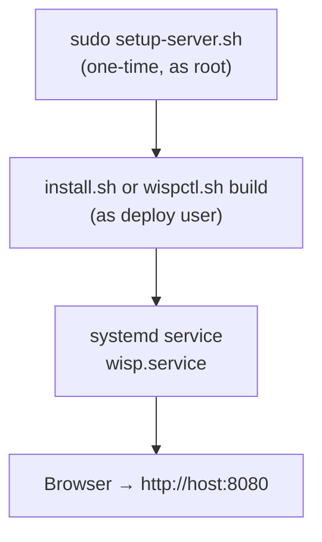

# Deployment

Wisp runs directly on a Linux server as a single systemd service — no Docker or containers. One Node process serves both the API and the prebuilt SPA. This document covers server setup, installation, developer workflow, packaging, and the production server architecture.

## Deployment Overview



### Script and unit layout (repo)

- **`scripts/install.sh`**, **`scripts/setup-server.sh`**, and **`scripts/wispctl.sh`** are thin wrappers that `exec` the Linux implementations under **`scripts/linux/`**.
- Server setup sub-scripts live in **`scripts/linux/setup/`**.
- Systemd unit templates live in **`systemd/linux/`** (copied into the install tree as `systemd/linux/*.service`).

## Supported Linux Distributions

Wisp setup scripts support **Debian/Ubuntu** and **Arch Linux**. Distro detection is handled automatically by `scripts/linux/setup/distro.sh`, which is sourced by the scripts that install packages. Other distributions are not currently supported; `setup-server.sh` will print an error and exit if the distro is unrecognised.

### Arch Linux notes

- Node.js, containerd, libvirt, QEMU, and most tools are installed from the official Arch repos.
- `swtpm` (software TPM / vTPM support) is in AUR and is **not** installed automatically. Install it manually with an AUR helper (e.g. `yay -S swtpm`) if vTPM is needed.
- `wisp-os-update` (OS update helper) supports Arch via `pacman`. The helper detects the distro at runtime; `install-helpers.sh` installs it on Arch the same way as Debian/Ubuntu.
- Bridged networking uses `systemd-networkd` if it is active, otherwise falls back to NetworkManager (`nmcli`). If neither is running, the error message includes instructions for enabling systemd-networkd or configuring the bridge manually.

## Server Prerequisites (`setup-server.sh`)

One-time server preparation script. Run as root with `sudo`. Safe to re-run. It orchestrates sub-scripts in `scripts/linux/setup/`; each step runs independently so a single failure does not skip remaining steps. Failed steps are reported at the end. Each sub-script can also be run standalone for debugging or partial re-runs (see [Setup sub-scripts](#setup-sub-scripts)).

### What it does

1. **Detects deploy user** from `$SUDO_USER`

2. **Runs `scripts/linux/setup/packages.sh`** — Detects distro and installs Node.js 24+ and system packages:

   **Debian/Ubuntu** — Node.js via NodeSource; packages:
   - `qemu-system-x86` — KVM hypervisor (the old `qemu-kvm` transitional package was dropped in Ubuntu 24.04)
   - `libvirt-daemon-system` — libvirt daemon
   - `libvirt-clients` — CLI tools (virsh)
   - `libvirt-dbus` — DBus interface for libvirt (required by the app)
   - `ovmf` — UEFI firmware
   - `swtpm`, `swtpm-tools` — Software TPM
   - `avahi-daemon` — mDNS daemon for Local DNS registrations
   - `hwdata` — PCI and USB ID databases (`/usr/share/hwdata/pci.ids`, `usb.ids`); used by Host Overview PCI naming and host USB product-name fallback (Wisp reads these files only; it does not invoke `lspci` or `lsusb`)
   - `smartmontools` — `smartctl` backend for disk SMART summary reads (`wisp-smartctl` helper)
   - `cloud-image-utils` — cloud-init ISO generation
   - `genisoimage` — fallback ISO generation
   - `qemu-utils` — disk operations (qemu-img)

   **Arch Linux** — Node.js from official repos; equivalent packages:
   - `qemu-full` — KVM hypervisor + disk tools (replaces `qemu-kvm` + `qemu-utils`)
   - `libvirt` — libvirt daemon and CLI tools
   - `libvirt-dbus` — DBus interface for libvirt
   - `edk2-ovmf` — UEFI firmware (replaces `ovmf`)
   - `swtpm` — Software TPM (AUR; prints a warning and skips if not available in official repos)
   - `avahi` — mDNS daemon
   - `hwdata`, `smartmontools` — same as Debian
   - `cloud-utils` — cloud-init ISO generation (replaces `cloud-image-utils`)
   - `cdrtools` — ISO generation (replaces `genisoimage`)

3. **Runs `scripts/linux/setup/groups.sh`** — Adds deploy user to groups: `libvirt`, `kvm`, `input`; chmod `/dev/kvm`

4. **Runs `scripts/linux/setup/dirs.sh`** — Creates directories with permissions:
   | Path | Owner | Mode |
   |------|-------|------|
   | `/var/lib/wisp/images` | `$USER:libvirt` | `0775` |
   | `/var/lib/wisp/vms` | `$USER:libvirt` | `0775` |
   | `/var/lib/wisp/backups` | `$USER:libvirt` | `0775` |
   | `/var/lib/wisp/containers` | `$USER:libvirt` | `0775` |
   | `/mnt/wisp/smb` | `$USER:libvirt` | `0775` |

5. **Runs `scripts/linux/setup/libvirt.sh`** — Enables libvirt and `virtlogd`; disables libvirt default NAT network. On Debian/Ubuntu (including 26.04, which ships libvirt 12) the script enables the monolithic `libvirtd.service`. On distros that ship modular libvirt daemons (Fedora 35+, recent Arch) it socket-activates `virtqemud`, `virtnetworkd`, `virtstoraged`, `virtnodedevd`, `virtsecretd`, `virtproxyd`, `virtinterfaced`, `virtnwfilterd` instead — `virtproxyd.socket` provides the legacy `/var/run/libvirt/libvirt-sock` path that libvirt-dbus and the sanity check expect.

6. **Optionally runs `scripts/linux/setup/bridge.sh`** — Bridged networking (br0). Skipped when `--skip-bridge` is passed (e.g. from `install.sh`, which offers bridge at end of install).

7. **Runs `scripts/linux/setup/containerd.sh`** — Installs containerd 2.0+ (from the official Docker apt repo on Debian/Ubuntu; from the official Arch repo on Arch Linux), creates a `containerd` system group, adds the deploy user to it, configures the socket `gid` in `/etc/containerd/config.toml` so the deploy user can connect, enables the service, creates the `wisp` namespace

8. **Runs `scripts/linux/setup/cni.sh`** — Installs CNI plugins (bridge, dhcp, etc.) to `/opt/cni/bin/`, removes any legacy `10-wisp-macvlan.conflist`, and **overwrites** `/etc/cni/net.d/10-wisp-bridge.conflist` each time with the default-route Linux bridge as the `bridge` master (aborts if that interface is not an existing bridge — run `bridge.sh` first). Enables the `cni-dhcp` systemd service for DHCP IPAM.

9. **Runs `scripts/linux/setup/sanity.sh`** — Verifies virsh, /dev/kvm, libvirt socket, org.libvirt DBus service

10. **Runs `scripts/linux/setup/install-helpers.sh`** — Copies each `backend/scripts/wisp-*` helper to `/usr/local/bin` and refreshes `/etc/sudoers.d/*` (via `helper.sh`). Idempotent and safe to re-run on every upgrade. See [Privileged helpers checklist](#privileged-helpers-checklist) when adding a new helper.

11. **Runs `scripts/linux/setup/rapl.sh`** — Optionally grants deploy user read access to Intel RAPL (`/sys/class/powercap/intel-rapl/intel-rapl:0/energy_uj`) so the app can show CPU power in Host Overview when running as the deploy user. Tries `setfacl` first; if sysfs is mounted with `noacl`, creates group `wisp-power`, adds the deploy user to it, and installs a udev rule (`/etc/udev/rules.d/99-wisp-rapl.rules`) that runs `chgrp`/`chmod g+r` on the RAPL `energy_uj` file so the group can read it. Deploy user must log out and back in (or run `newgrp wisp-power`) for the group to take effect. Skipped if the path does not exist (e.g. VM or non-Intel).

### Post-setup

Group changes (e.g. `libvirt`, `containerd`, `wisp-power`) require logging out and back in (or `newgrp <group>`).

### Setup sub-scripts (`scripts/linux/setup/`)

Server setup and install logic is split into standalone scripts under `scripts/linux/setup/`. Each can be run directly for debugging or to re-run a single step:

| Script | Run as | Purpose |
|--------|--------|---------|
| `packages.sh` | root | Node.js 24+, QEMU/KVM/libvirt stack |
| `groups.sh <user>` | root | Add user to libvirt/kvm/input; chmod /dev/kvm |
| `dirs.sh <user>` | root | Create /var/lib/wisp/*, /mnt/wisp/smb |
| `libvirt.sh` | root | Enable modular libvirt daemons (virtqemud + sidecars) or monolithic `libvirtd`; enable `virtlogd`; disable default NAT |
| `sanity.sh` | root or libvirt user | Verify virsh, /dev/kvm, socket, DBus |
| `helper.sh <src> <basename> <user> [pkg...]` | root | Copy one script to `/usr/local/bin/<basename>` + sudoers (used by `install-helpers.sh`) |
| `install-helpers.sh <project-root> <user>` | root | Install or **refresh** all `wisp-*` helpers from the install tree → `/usr/local/bin` |
| `rapl.sh <user>` | root | Intel RAPL read access for Host Overview |
| `containerd.sh [user]` | root | Install containerd 2.0+, socket group perms, wisp namespace |
| `cni.sh` | root | CNI plugins (bridge, dhcp); **overwrites** `10-wisp-bridge.conflist`; DHCP daemon |
| `bridge.sh` | root | Create br0 on primary NIC (netplan / nmcli / systemd-networkd) |
| `container-dns.sh` | root | Assign link-local `169.254.53.53/32` to br0 at runtime (the bind address for Wisp's in-process DNS forwarder; runtime-only — re-asserted by `wisp.service` `ExecStartPre` and by `wisp-bridge` after `netplan apply`) and write `/var/lib/wisp/container-resolv.conf` for bind-mounting into containers. |
| `copy.sh <source-dir> <install-dir>` | user | Replace `frontend/`, `backend/`, `scripts/`, `systemd/`; refresh `config/*.example` |
| `config.sh <install-dir> [server-name]` | user | `config/wisp-config.json` from example + serverName |
| `password.sh <install-dir> [--force]` | user | `config/wisp-password` (scrypt hash) |
| `permissions.sh <install-dir>` | user | chmod secrets and scripts |

Example: `sudo scripts/linux/setup/sanity.sh` or `scripts/linux/setup/password.sh /opt/wisp --force`.

## Installation (`install.sh`)

Run as the deploy user from the unpacked release root (or repo root).

```
./scripts/install.sh [install-dir] [--restart-svc]
```

| Argument | Description |
|----------|-------------|
| `install-dir` | Target directory. If omitted, prompts interactively (default `/opt/wisp`). |
| `--restart-svc` | Auto-restart (or install+start) systemd services without prompting. Also skips the bridged-networking prompt. |

Steps: prompts for install directory (unless provided as arg), runs `scripts/linux/setup/copy.sh`, then `sudo setup-server.sh --skip-bridge`, then `config.sh`, `password.sh`, `wispctl.sh build`, and `permissions.sh`. For systemd: if `wisp.service` is not yet installed, optionally installs and starts it; if it already exists (e.g. upgrade), prompts to **restart** it instead (default yes) — unless `--restart-svc` is set, which does it automatically. Optionally offers bridged networking (`scripts/linux/setup/bridge.sh`) in interactive mode only.

1. **Copy and server setup:** `copy.sh` then `sudo setup-server.sh`
2. **Config and password:** `config.sh`, `password.sh`
3. **Build:** `wispctl.sh build`
4. **Permissions:** `permissions.sh`
5. **Optional:** systemd install+start or restart (see above), bridged networking (interactive only)

## `wispctl.sh helpers` (after upgrade)

On Linux, from the install directory:

```bash
./scripts/wispctl.sh helpers
```

Runs `sudo scripts/linux/setup/install-helpers.sh` with the current user as deploy user. Use after pulling or copying a new app version so `/usr/local/bin/wisp-*` matches `backend/scripts/` (sudoers entries are rewritten; same paths, updated script bodies).

## Build Process (`wispctl.sh build`)

1. **Optional `config/runtime.env`** — not required; defaults apply for ports if absent
2. **Backend:** `npm ci --omit=dev --omit=optional` in `backend/` (deterministic install from lock file)
3. **noVNC:** `vendor-novnc.sh` → `frontend/public/vendor/novnc/`
4. **Frontend:** `npm install && npm run build` in `frontend/`

## Running the App

### Local (non-systemd)

```
wispctl.sh local start      # Start the Wisp process
wispctl.sh local stop       # Stop it
wispctl.sh local restart    # Stop then start
wispctl.sh local status     # Show running state
wispctl.sh local logs       # Follow log
wispctl.sh local tail [n]   # Show last n lines
```

Local mode runs the Wisp process as a `nohup` background process. PID is stored in `.pids/wisp.pid`, log in `.logs/wisp.log`.

### Systemd (production)

```
wispctl.sh svc install      # Install and enable wisp.service
wispctl.sh svc start        # Start via systemd
wispctl.sh svc stop         # Stop via systemd
wispctl.sh svc restart      # Restart
wispctl.sh svc logs         # journalctl -u wisp -f
wispctl.sh svc uninstall    # Remove unit
wispctl.sh password [--force]   # Set or reset config/wisp-password
```

## Systemd Service Unit

A single service unit in `systemd/linux/`:

### `wisp.service`

```ini
[Unit]
Description=Wisp
After=network-online.target libvirtd.service virtqemud.service containerd.service
Wants=network-online.target

[Service]
User=WISP_USER
WorkingDirectory=WISP_PATH/backend
EnvironmentFile=-WISP_PATH/config/runtime.env
ExecStartPre=+/bin/sh -c '...assigns 169.254.53.53/32 to br0 if needed...'
ExecStart=/usr/bin/node src/index.js
AmbientCapabilities=CAP_NET_BIND_SERVICE
Restart=on-failure
RestartSec=5
TimeoutStopSec=15

[Install]
WantedBy=multi-user.target
```

`TimeoutStopSec=15` limits how long systemd waits for a clean exit after SIGTERM (default is 90s). If the process does not exit within 15 seconds, systemd sends SIGKILL.

On SIGTERM/SIGINT, Wisp closes all active SSE streams, stops the background OS update checker (**aborting any in-flight `wisp-os-update check` subprocess**, which can otherwise run up to two minutes and block exit), disconnects from the system DBus (libvirt), calls `server.closeAllConnections()` when available, then runs Fastify `close()` with `forceCloseConnections` so WebSockets and other keep-alive connections are torn down. The process should exit well within this window so `wispctl.sh svc stop` does not sit at the full stop timeout.

If `svc stop` still hangs, confirm the installed unit includes `TimeoutStopSec=15` (`systemctl show -p TimeoutStopUSec wisp`); older installs without it use systemd’s default (often 90s), which feels like a "minute-plus" stop.

### SPA serving

In production, the same Node process serves the prebuilt SPA from `frontend/dist/` (and `/vendor/*` from `frontend/public/vendor/` for noVNC). `@fastify/static` is registered after the `/api` and `/ws` route trees; an `onSend` hook adds CSP + `X-Content-Type-Options` + `X-Frame-Options` + `Referrer-Policy` headers; `setNotFoundHandler` returns `dist/index.html` for non-`/api` / non-`/ws` paths so client-side routing survives deep-link refresh. The auth hook bypasses non-API/WS paths so the bundle and login page load without a session — `/api/*` still requires the JWT cookie.

### Placeholder substitution

During `svc install`, `wispctl.sh` substitutes `WISP_USER` and `WISP_PATH` into `systemd/linux/wisp.service`, which is installed as `/etc/systemd/system/wisp.service`.

#### Troubleshooting: `svc install` exits early; `Unit … not found`

`config/runtime.env` is optional (systemd uses `EnvironmentFile=-…`). An older `wispctl.sh` could exit with `set -e` before printing `=== Installing systemd unit ===` when `runtime.env` was missing (bare `return` after a failed `[[ -f … ]]` test inherited a non-zero status). **Fix:** use current `scripts/wispctl.sh` (`normalize_runtime_env` uses `return 0` when the file is absent). Otherwise verify `sudo` works and `/opt/wisp/systemd/linux/wisp.service` exists.

## Developer Workflow

### Local development

For frontend development on macOS (backend runs on Linux server):

1. Run backend on the Linux server: `cd backend && npm run dev` (uses `--watch` for auto-reload)
2. Configure Vite proxy to point to the server
3. Run frontend locally: `cd frontend && npm run dev`
4. Vite dev server at `localhost:5173` proxies `/api` and `/ws` to the backend

Backend enables CORS for `localhost:5173` when `NODE_ENV=development`.

On macOS, the backend starts without connecting to libvirt (dev mode) — VM operations are unavailable but the server starts.

### Push deploy (`push.sh`)

Package and deploy to a remote server:

```
./scripts/push.sh user@server-ip /remote/path [--restart-svc]
```

1. **Package** — runs `scripts/package.sh` to create `build/wisp-<version>.zip`
2. **Upload** — `scp` the zip to `/tmp` on the remote server
3. **Remote install** — SSH into the server, unzip to `/tmp/wisp-update`, run `scripts/install.sh <remote-path> [--restart-svc]`
4. **Cleanup** — removes the staging directory and zip from `/tmp`

Pass `--restart-svc` to auto-restart systemd services after install (no interactive prompts on the server).

## Updating the app (after install)

The recommended path is **self-update from the UI** — Host → Software → Wisp Update. Wisp polls GitHub Releases hourly, surfaces a badge on the Software tab when a new tag is published, and downloads + verifies + atomic-swaps the new tarball via `wisp-updater.service` (a `Type=oneshot` systemd unit triggered by the backend). See [UPDATES.md](UPDATES.md) for the pipeline, API, and rollback semantics.

Manual paths remain supported:

- From a **full git checkout** on the server: pull, then **`./scripts/wispctl.sh helpers`** (refreshes `/usr/local/bin` privileged scripts), then `./scripts/wispctl.sh build` and restart (`svc restart` or `local restart`).
- From a **release tarball** (the same artifact the self-updater pulls from GitHub): extract over a working directory, then `./scripts/install.sh <path> --restart-svc` — `install.sh` auto-detects the prebuilt `frontend/dist/` and skips the frontend build.
- From a **slim zip** install: unpack/replace app dirs while preserving `config/`, then run **`sudo <install>/scripts/linux/setup/install-helpers.sh <install> <deploy-user>`** (or `wispctl helpers` from `<install>`), then `wispctl.sh build` and restart. Skipping `helpers` after an upgrade can leave stale `wisp-*` shims on the host.

### Cutting a release (maintainers)

```bash
# Edit CHANGELOG.md (add a new "## YYYY-MM-DD" section at the top), do NOT commit it.
./scripts/release.sh 1.0.6        # bumps versions + retitles CHANGELOG + folds it into a single release commit + tags v1.0.6
git push && git push origin v1.0.6
```

`release.sh` accepts `CHANGELOG.md` as the only dirty file in the working tree, so the new section lands in the same `release: vX.Y.Z` commit as the version bumps — no separate changelog commit needed.

The `v1.0.6` tag triggers `.github/workflows/release.yml`, which builds the frontend, packages `wisp-1.0.6.tar.gz` (with prebuilt `frontend/dist/`) plus a `.sha256`, extracts the matching CHANGELOG section as release notes, and creates the GitHub Release. Tags shaped `v*-*` (e.g. `v1.0.6-rc.1`) are published as prereleases — these are not surfaced by the in-app auto-checker (GitHub's `releases/latest` endpoint excludes prereleases).

### Push from a dev machine (`push.sh`)

```bash
./scripts/push.sh user@server-ip /opt/wisp --restart-svc
```

Packages the project into a zip, uploads it to the server, unzips to a staging directory, and runs `install.sh` with the target path. With `--restart-svc`, systemd services are restarted automatically. Without it, `install.sh` prompts interactively on the server.

## Packaging (`package.sh`)

```
./scripts/package.sh
```

1. Reads version from `frontend/package.json`
2. Writes `build/wisp-<version>.zip` containing **only** `frontend/`, `backend/`, `scripts/`, `systemd/`, and `config/*.example` files (no docs, no root `.env`).

On the server: unzip, then `./scripts/install.sh` (runs `setup-server.sh` with sudo as part of the flow).

## Helper Scripts

### Privileged helpers checklist (maintainers)

When you add a new **`backend/scripts/wisp-*`** script that the app runs via **`sudo -n`**:

1. **Register it** in **`scripts/linux/setup/install-helpers.sh`** (one `helper.sh` invocation; add apt packages as extra args if needed).
2. **Backend** — Prefer **`/usr/local/bin/<name>`** first, then bundled `backend/scripts/`, with an optional env override (match `host/linux/osUpdates.js` / `host/linux/hostPower.js` / `host/linux/hostHardware.js` patterns).
3. **Docs** — `docs/spec/DEPLOYMENT.md` (this section), `docs/spec/API.md` / `CONFIGURATION.md` / `docs/ARCHITECTURE.md` as appropriate; **`docs/WISP-RULES.md`** shell-exec list.
4. **Install / upgrade** — Covered automatically if step 1 is done (`setup-server.sh`, **`wispctl.sh helpers`**, **`push.sh`** all invoke `install-helpers.sh`).

### `wisp-os-update` (installed to `/usr/local/bin/`)

OS package update helper invoked via `sudo`. Detects the distro at runtime from `/etc/os-release` and uses the appropriate package manager:

| Distro | `check` | `upgrade` |
|--------|---------|-----------|
| Debian/Ubuntu | `apt-get update` + `apt-get -s upgrade` (dry-run count) | `apt-get update && apt-get upgrade -y` |
| Arch Linux | `pacman -Sy` + `pacman -Qu \| wc -l` | `pacman -Syu --noconfirm` |

| Command | Description |
|---------|-------------|
| `wisp-os-update check` | Sync package DB, count upgradable packages (prints one integer) |
| `wisp-os-update upgrade` | Sync package DB and perform a full non-interactive upgrade |

The backend invokes **`/usr/local/bin/wisp-os-update`** only. `install-helpers.sh` (via `setup-server.sh` or `wispctl helpers`) installs it and configures sudoers. If the file is missing, OS update APIs return 503.

#### Troubleshooting: OS update check not working

1. **Backend logs** — 503 responses include `detail` (often sudo/package manager stderr).
2. **Path** — Confirm `/usr/local/bin/wisp-os-update` exists and `setup-server.sh` completed the helper step.
3. **Privilege** — `/etc/sudoers.d/wisp-os-update` should allow: `<deploy_user> ALL=(root) NOPASSWD: /usr/local/bin/wisp-os-update`. Test: `sudo -n /usr/local/bin/wisp-os-update check`.
4. **Package manager** — On Debian/Ubuntu, network and apt sources must work. On Arch, `pacman` must be functional and the keyring up to date.
5. **Distro detection** — The script reads `/etc/os-release`; if the distro is unrecognised it exits 1 with an error message.

### `wisp-mount` (installed to `/usr/local/bin/`)

Unified mount helper for SMB shares and adopted removable drives. Invoked via `sudo`:

| Command | Description |
|---------|-------------|
| `wisp-mount smb mount <configPath>` | Mount an SMB share (config file supplies share, mountPath, username, password, uid, gid) |
| `wisp-mount smb check <configPath>` | Test SMB connectivity by mounting then unmounting |
| `wisp-mount disk mount <configPath>` | Mount an adopted removable drive by UUID (config file supplies uuid, mountPath, fsType, readOnly, uid, gid) |
| `wisp-mount unmount <path>` | Unmount a mount point |
| `wisp-mount unmount-lazy <path>` | Lazy-unmount (`umount -l`) for surprise-removed devices |

Requires `cifs-utils`. The backend writes a temp config file (mode `0600`) per operation, invokes `wisp-mount` via `sudo -n`, then removes the config file. The helper also deletes the config file after use. `install-helpers.sh` now installs `wisp-mount` and automatically removes any legacy `/usr/local/bin/wisp-smb` (+ its sudoers entry) from prior installs.

### `wisp-dmidecode` (installed to `/usr/local/bin/`)

Reads SMBIOS memory devices (`dmidecode --type 17`) and prints JSON for Host Overview RAM modules. Invoked via `sudo -n` as the deploy user.

The backend tries **`/usr/local/bin/wisp-dmidecode`** first (after server setup), then the bundled script under `backend/scripts/` if `WISP_DMIDECODE_SCRIPT` is unset. `setup-server.sh` installs the helper, installs the `dmidecode` package, and adds `/etc/sudoers.d/wisp-dmidecode` so `sudo -n /usr/local/bin/wisp-dmidecode` succeeds.

If the array is empty in the API: helper missing, sudoers not configured, `dmidecode` unavailable, or a VM/guest with no useful DMI (expected).

#### Troubleshooting: RAM modules not listed

1. **Test** — As deploy user: `sudo -n /usr/local/bin/wisp-dmidecode` should print JSON `[...]`. Compare with **`dmidecode --type 17`** (not the full `dmidecode` dump): each populated slot should have a numeric **Size** line (`MB`/`MiB`/`GB`/`GiB`).
2. **Re-run setup** — `sudo scripts/setup-server.sh` or **`./scripts/wispctl.sh helpers`** so `/usr/local/bin/wisp-dmidecode` matches the version in `backend/scripts/`.
3. **DMI** — Some environments expose no DIMM entries; live usage stats still come from `/proc`.

### `wisp-smartctl` (installed to `/usr/local/bin/`)

Reads per-disk SMART summaries for `GET /api/host/hardware` by running `smartctl --json -a /dev/<disk>` and returning JSON to the backend. Invoked via `sudo -n` as the deploy user.

The backend tries **`/usr/local/bin/wisp-smartctl`** first (after server setup), then the bundled script under `backend/scripts/` if `WISP_SMARTCTL_SCRIPT` is unset. `setup-server.sh` installs the helper and `/etc/sudoers.d/wisp-smartctl`; package install ensures `smartmontools` is present.

If SMART fields are unavailable in the API for a disk, the backend keeps the disk row and returns `smart.supported: false` with a per-disk `smart.error`.

### `wisp-power` (installed to `/usr/local/bin/`)

Runs `shutdown -h now` or `shutdown -r now` for Host panel power actions. Invoked via `sudo -n` as the deploy user.

The backend tries **`/usr/local/bin/wisp-power`** first, then the bundled `backend/scripts/wisp-power`, unless `WISP_POWER_SCRIPT` is set. `setup-server.sh` installs the helper and `/etc/sudoers.d/wisp-power`.

**Troubleshooting:** As deploy user, `sudo -n /usr/local/bin/wisp-power` should print usage and exit 1 if sudoers allow the script (do not pass `shutdown`/`reboot` except on a host you intend to power off). Confirm `/etc/sudoers.d/wisp-power`: `<deploy_user> ALL=(root) NOPASSWD: /usr/local/bin/wisp-power`.

### `wisp-netns` (installed to `/usr/local/bin/`)

Creates or removes a network namespace under `/var/run/netns/<name>` using `mkdir -p` and `ip netns add|delete`. The backend runs as the deploy user and cannot create that directory or netns without privilege; it invokes **`sudo -n /usr/local/bin/wisp-netns add|delete <name>`**.

| Arguments | Description |
|-----------|-------------|
| `add <name>` | Ensure netns exists (idempotent if bind mount already present) |
| `delete <name>` | Best-effort `ip netns delete` |
| `ipv4 <name> [ifname]` | Print `ip -4 addr show dev <ifname>` inside the netns (default `eth0`). Used to persist DHCP-assigned addresses when the CNI ADD result has no `ips[]`. |
| `route-add <name> <ifname> <ipv4>` | `ip -n <name> route replace <ipv4>/32 dev <ifname>` — installs an on-link /32 route inside the container's netns so the systemd-resolved mDNS stub IP (`169.254.53.53`) is reachable via the veth instead of being sent to the LAN gateway and black-holed. |

**Troubleshooting:** `EACCES` on `mkdir '/var/run/netns'` in backend logs → helpers not installed or sudoers missing. Run **`sudo ./scripts/linux/setup/install-helpers.sh <project-root> <deploy-user>`** or **`./scripts/wispctl.sh helpers`**. Test: `sudo -n /usr/local/bin/wisp-netns add wisp-netns-test` then `sudo -n /usr/local/bin/wisp-netns delete wisp-netns-test`. After upgrading Wisp, re-run install-helpers so **`wisp-netns ipv4`** and **`wisp-netns route-add`** exist; otherwise container **network IP** may stay blank or `.local` resolution from containers on br0 fails.

### `wisp-cni` (installed to `/usr/local/bin/`)

Runs a single CNI plugin binary from `CNI_PATH` (default `/opt/cni/bin`) with config JSON read from a temp file, setting `CNI_COMMAND`, `CNI_CONTAINERID`, `CNI_NETNS`, `CNI_IFNAME`, `CNI_PATH`. Used for bridge **ADD** / **DEL** so the deploy user does not need ambient `CAP_NET_ADMIN` on the Node process.

**Usage (do not run by hand unless debugging):** `wisp-cni ADD\|DEL <plugin_basename> <container_id> <netns_path> <config.json> [<cni_bin_dir>]`. The backend always passes `WISP_CNI_BIN_DIR` or `/opt/cni/bin` as the 6th argument so `sudo`’s env reset does not drop `CNI_PATH`.

**Troubleshooting:** If container start returns 200 but the task exits or CNI errors appear in logs:

1. **Plugin stdin** — The backend merges top-level `cniVersion` and `name` from the `.conflist` into each `plugins[]` entry before invoking the bridge plugin (a raw plugin fragment alone is invalid).
2. **Binaries** — `/opt/cni/bin/bridge` and `/opt/cni/bin/dhcp` exist (`scripts/linux/setup/cni.sh`).
3. **DHCP daemon** — For `ipam.type: dhcp`, **`cni-dhcp.service`** must be active (`systemctl status cni-dhcp`). If it is down, bridge ADD fails to obtain an IP.
4. **Bridge interface** — `bridge` must name an existing Linux bridge on the host (e.g. `br0` or a managed VLAN bridge such as `br0-vlan10`). The backend asserts `/sys/class/net/<iface>/bridge` exists before every CNI ADD; otherwise ADD is refused with `CONTAINERD_ERROR`. If the default route is not via a bridge, run `scripts/linux/setup/bridge.sh` to create `br0`, then re-run `cni.sh`.
5. **Sudoers** — `sudo -n /usr/local/bin/wisp-cni` succeeds as the deploy user.

### `wisp-bridge` (installed to `/usr/local/bin/`)

Manages Host Mgmt VLAN-tagged bridges through netplan and is invoked via `sudo -n` by the backend host routes.

| Command | Description |
|---------|-------------|
| `wisp-bridge create-vlan-bridge --base <bridge> --vlan <id> --name <bridgeName> --file-name <name>.yaml` | Write managed netplan VLAN+bridge file and run `netplan apply` |
| `wisp-bridge delete-vlan-bridge --base <bridge> --vlan <id> --name <bridgeName> --file-name <name>.yaml` | Remove managed netplan file, detach live links (`nomaster`), delete bridge+vlan interfaces, then run `netplan apply` |

The helper writes/removes only Wisp-managed files in `/etc/netplan` (`91-wisp-vlan__*`) and leaves unrelated netplan config untouched.

`--file-name` is validated against the regex `^91-wisp-vlan__[a-zA-Z0-9._-]+__[0-9]+__[a-zA-Z0-9._-]+\.yaml$` and the resolved path (`realpath -m`) must remain inside `/etc/netplan/`. This is defense-in-depth: it stops a future caller bug from turning the helper into an arbitrary-root-write primitive.

Parent safety checks are enforced in both backend and helper:

- parent must be an existing Linux bridge
- parent must not be VLAN-tagged
- parent must have at least one non-VLAN member interface

### `wisp-updater` (installed to `/usr/local/bin/`, run via `wisp-updater.service`)

Atomic-swap applier for the Wisp self-update pipeline. Not invoked directly — the backend triggers `wisp-updater.service` (a `Type=oneshot` systemd unit) via `sudo -n /usr/bin/systemctl start --no-block wisp-updater.service`. The unit's `WISP_INSTALL_DIR` env var is templated at install time; the staging path is read from `/var/lib/wisp/updates/target` (single line, must start with `/var/lib/wisp/updates/staging-`). See [UPDATES.md](UPDATES.md) for the full pipeline.

| Operation | Description |
|---------|-------------|
| `systemctl start --no-block wisp-updater.service` | Stop service → snapshot install to `<install>.prev/` → rsync staging into install (preserving `config/wisp-config.json`, `wisp-password`, `runtime.env`, `.pids`, `.logs`) → `npm ci --omit=dev` in backend → re-run `install-helpers.sh` (refreshes all wisp-* shims + the unit + sudoers) → re-template `wisp.service` → start service. Auto-rolls back from `<install>.prev/` on any failure. |

Steps are echoed to journald (`journalctl -u wisp-updater.service`) — Wisp does not capture them since it dies during `step:stop-service`.

### `vendor-novnc.sh`

See [noVNC.md](noVNC.md). Clones noVNC from GitHub and copies `core/` and `vendor/` into the frontend's public directory.

### `ensure-novnc.js`

Prebuild script that runs before `vite build`. Ensures noVNC is present; invokes `vendor-novnc.sh` if not.

## Config directory (`config/`)

| File | Tracked | Purpose |
|------|---------|---------|
| `runtime.env.example` | Yes | Optional process overrides template |
| `runtime.env` | No | Optional active overrides |
| `wisp-config.json.example` | Yes | Application settings template |
| `wisp-config.json` | No | Settings (UI) |
| `wisp-password` | No | Scrypt hash for login / JWT secret |
